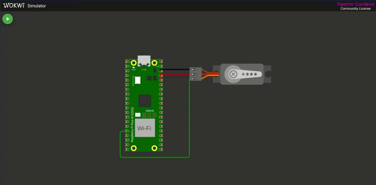

<div align="center">
    
</div>

<br>


<div align="center">

# Controle de Servo Motor a partir de Manipulação do PWM

</div>

## Descrição
Este projeto tem como objetivo explorar o módulo PWM (Pulse Width Modulation), presente no microcontrolador RP2040. A implementação envolve o controle do ângulo de um servomotor na plataforma de simulação Wokwi. Na placa BitDogLab, o pino correspondente ao servomotor foi substituído pelo LED azul, permitindo que a alteração do brilho ao longo do tempo fosse observada. Essa representação busca ilustrar o funcionamento do PWM de forma visual, demonstrando como a modulação da largura de pulso pode ser utilizada para controlar a intensidade luminosa do LED, simulando o comportamento de um servomotor.

## Requisitos
- **Configuração da Frequência PWM (20% da nota):** Configurar a frequência do PWM de um dos pinos GPIO da placa para aproximadamente 50Hz (período de 20ms);
- **Posicionamento do Servomotor em 180° (10% da nota):** Definir o ciclo ativo (Duty Cycle) do PWM para 2400μs. Isso posicionará o braço do servomotor em aproximadamente 180 graus. Essa posição deve ser mantida por 5 segundos;
- **Posicionamento do Servomotor em 90° (10% da nota):** Definir o ciclo ativo (Duty Cycle) do PWM para 1470μs. Isso posicionará o braço do servomotor em aproximadamente 90 graus. Essa posição deve ser mantida por 5 segundos;
- **Posicionamento do Servomotor em 0° (10% da nota):** Definir o ciclo ativo (Duty Cycle) do PWM para 500μs. Isso posicionará o braço do servomotor em aproximadamente 0 graus. Essa posição deve ser mantida por 5 segundos;
- **Rotina de Movimentação Periódica (35% da nota):** Após as etapas anteriores, criar uma rotina para mover o braço do servomotor periodicamente entre 0° e 180°. A movimentação deve ser suave. Para isso, incremente o ciclo ativo em passos de ±5μs, com um atraso de 10 ms entre cada ajuste.
- **Experimento com o LED RGB na BitDogLab (15% da nota):** Utilizando a ferramenta educacional BitDogLab, executar o código deste exercício com o LED RGB (GPIO 12). 

## Formalidades 

### **O que é PWM?**
PWM (**Pulse Width Modulation** ou **Modulação por Largura de Pulso**) é uma técnica usada para **controlar dispositivos analógicos** (como servomotores, LEDs e motores DC) **usando sinais digitais**.

Um sinal **PWM** alterna entre **Nível Alto (1)** e **Nível Baixo (0)** rapidamente. A principal característica desse sinal é:
- **Frequência**: Quantas vezes o ciclo PWM se repete por segundo.
- **Duty Cycle** (Ciclo de Trabalho): Porcentagem do tempo em que o sinal está **ALTO (1)** dentro de um ciclo completo.

### **PWM no Raspberry Pi Pico**
O **RP2040** (chip do Pico) tem um **hardware PWM interno**:
- **8 Slices de PWM** → Cada um pode controlar **2 pinos**.
- **Resolução de 16 bits** → Contador interno de **0 a 65535**.
- **Frequência ajustável** pelo **Clock Divider**.

### **Configurando o PWM no Código**
O código configura um **PWM de 50Hz (20ms de período)** para controlar o servo motor.

#### **1️. Habilitar a Função PWM na GPIO**
```c
gpio_set_function(SERVO, GPIO_FUNC_PWM);
```
Isso define o **GPIO 12** como saída de **PWM**.


#### **2️. Obter o "Slice" do PWM**
```c
uint slice = pwm_gpio_to_slice_num(SERVO);
```
O RP2040 possui **8 slices PWM**. Esse comando retorna qual **slice** está associado ao **GPIO 12**.


#### **3️. Configurar o Clock PWM**
```c
pwm_set_clkdiv(slice, 125.0);
```
O RP2040 roda com um **Clock Base de 125MHz** e o divisor **reduz essa frequência** para um valor adequado.

Fórmula para calcular a frequência final do contador PWM:

<div align="center">

$\text{Freq}_{\text{PWM}} = \frac{\text{Clock Base}}{\text{Clock Divisor} \times \text{WRAP}}$


</div>

Substituindo os valores:

<div align="center">

$\text{Freq}_\text{PWM} = \frac{125000000}{125 \times 20000} = 50Hz$

</div>

Isso faz com que o **contador PWM complete um ciclo a cada 20ms (50Hz)**, que é o período exigido para um **servo motor**.


#### **4️. Definir o Máximo do Contador**
```c
pwm_set_wrap(slice, WRAP);
```
Isso define o valor **máximo** do contador PWM. Aqui, usamos:
```c
#define WRAP 20000
```
Isso significa que o **contador irá de 0 até 20000** antes de reiniciar.

#### **5️. Ativar o PWM**
```c
pwm_set_enabled(slice, true);
```
Essa função **habilita o PWM** no slice correspondente.


###  **Controlando o Servo**
Um **servo motor** lê um **pulso PWM específico** para definir um ângulo.  
O **tempo em nível ALTO** do pulso **define a posição**:


<div align="center">

| Posição | Pulso (µs) | Pulso Normalizado (0-20000) |
|---------|-----------|----------------------------|
| 0°      | 500µs    | (500 × 20000) / 20000 = **500**  |
| 90°     | 1470µs   | (1470 × 20000) / 20000 = **1470** |
| 180°    | 2400µs   | (2400 × 20000) / 20000 = **2400** |

</div>

A função que faz essa conversão é:
```c
void set_servo_position(uint slice, uint16_t pulse_us) {
    uint cycle = (pulse_us * WRAP) / 20000;
    pwm_set_gpio_level(SERVO, cycle);
}
```
- **Converte o tempo do pulso para o valor do contador**.
- **Define o nível do PWM** para gerar esse pulso.

Se chamarmos `set_servo_position(slice, 1470)`, o servo irá para **90°**.

## Testes

A seguir, é possível ver a execução do projeto no vscode através da extensão Wokwi e, também, a demonstração no harware físico com o auxílio da placa BitDogLab.




## Instruções de Uso

1. **Clonar o Repositório**:

```bash
git clone https://github.com/yasmincsme/embarcatech-U4C4-Interrupcoes.git
```

2. **Compilar e Carregar o Código**:
   No VS Code, configure o ambiente e compile o projeto com os comandos:

```bash	
cmake -G Ninja ..
ninja
```

3. **Interação com a Placa**:
   - Conecte a placa ao computador.
   - Clique em run usando a extensão do raspberry pi pico.

4. **Interação com o Simulador**
    - Inicie a simulação no vscode com o auxílio da extensão Wokwi ou acesse [este link](https://wokwi.com/projects/422643086287527937).


